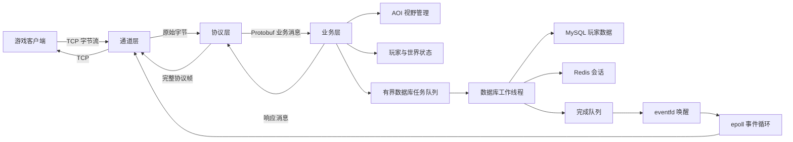

# C++ epoll MMO Game Server

基于 C++、Linux `epoll`、TCP、Protobuf、网格 AOI、MySQL 与 Redis 设计的轻量级 MMO 游戏服务器学习项目。

## 项目概览

| 项目 | 说明 |
| --- | --- |
| 开发语言 | C++ |
| 运行平台 | Linux |
| 网络模型 | 单线程 epoll LT 事件循环 |
| 通信协议 | TCP + 自定义长度帧 + Protobuf |
| 视野管理 | 网格九宫格 AOI |
| 数据访问 | MySQL 持久化 + Redis TTL 会话 + 有界工作线程池 |
| 当前状态 | 可运行服务器与客户端已完成，MySQL/Redis 端到端链路已通过测试 |

项目围绕四个问题展开：

1. 如何分离网络收发、协议解析和游戏业务；
2. 如何在 TCP 字节流上识别完整的游戏消息；
3. 如何避免玩家移动消息无差别广播给全服玩家；
4. 如何避免数据库查询阻塞网络事件循环。

## 架构设计

服务器采用“通道层—协议层—业务层”的职责划分，并通过有界工作线程池隔离阻塞式数据库访问。



### 通道层

- 管理监听套接字和客户端连接；
- 处理 `accept`、`recv`、`send` 与连接关闭；
- 将收到的原始字节交给协议层；
- 不包含具体游戏规则。

### 协议层

- 从 TCP 字节流中提取完整的应用层消息；
- 根据消息类型创建对应的 Protobuf 对象；
- 完成序列化、反序列化、组帧和解帧；
- 在业务消息与网络字节之间建立边界。

### 业务层

- 处理玩家上线、下线、移动和世界聊天；
- 管理玩家 ID、昵称、坐标与场景状态；
- 根据 AOI 查询结果决定消息接收者；
- 通过协议对象发送业务响应，不直接调用 socket API。

## epoll 事件循环

Linux 中，监听套接字、客户端连接和 `eventfd` 都可以通过文件描述符表示。服务器可将这些文件描述符注册到同一个 epoll 实例，由一个事件循环统一分发：

```text
监听套接字可读  -> accept 新连接
客户端连接可读  -> recv 玩家消息
客户端连接可写  -> 发送缓冲区数据
eventfd 可读     -> 取出数据库完成结果
```

epoll 只负责通知“哪些文件描述符已经就绪”，实际的连接建立、数据收发和业务处理仍由服务器完成。

## 应用层协议

TCP 是连续字节流，不保存应用层消息边界。项目使用固定 8 字节消息头：

```text
+----------------------+----------------------+-------------------+
| Payload Length (4B)  | Message Type (4B)    | Protobuf Payload  |
+----------------------+----------------------+-------------------+
```

独立实现使用网络字节序保存两个 4 字节字段。`FrameDecoder` 维护增量接收缓冲区：

1. 新数据先追加到缓冲区；
2. 不足 8 字节时等待下一次接收；
3. 读取消息体长度与消息类型；
4. 消息体未收完整时保留现有数据；
5. 收到完整消息后取出并反序列化；
6. 缓冲区仍有数据时继续解析下一帧。

该过程同时覆盖：

- 半包：一条消息分多次到达；
- 粘包：多条消息在一次读取中到达；
- 连续帧：解析一帧后继续消费剩余字节。

Protobuf 负责“业务对象与二进制消息体之间的转换”，长度帧负责“确定一条消息从哪里开始、到哪里结束”，两者职责不同。

业务消息定义在 [`proto/game_messages.proto`](proto/game_messages.proto)。`protobuf_codec` 负责消息对象与帧载荷之间的转换，并对消息 ID 和反序列化结果进行校验。

## AOI 视野管理

如果每次移动都通知全部 `N` 名玩家，单次广播需要遍历接近 `N` 个连接。项目将地图划分为固定网格，以当前格及周围八格组成的九宫格作为兴趣区域。

```text
+-----+-----+-----+
|     |     |     |
+-----+-----+-----+
|     |  P  |     |   P：当前玩家所在网格
+-----+-----+-----+
|     |     |     |
+-----+-----+-----+
```

玩家跨格移动时分别计算旧视野和新视野：

- `旧视野 - 新视野`：离开视野的玩家；
- `新视野 - 旧视野`：进入视野的玩家；
- `新视野交集`：继续接收位置更新的玩家。

因此，移动广播对象数由全服玩家数 `N` 收敛为邻域玩家数 `K`。这是广播范围的算法变化，不等同于未经压测的具体性能提升比例。

当前 `AoiWorld` 已实现玩家加入、移除、九宫格查询和跨格移动差集，并保证查询及差集结果不包含玩家自身。

## 自动测试

当前测试覆盖协议帧、AOI、异步任务调度、`eventfd` 完成通知，以及可选的 MySQL/Redis 真实集成测试；不包含时间轮测试。

协议测试覆盖：

- 网络字节序编码；
- 分段帧与半包；
- 连续帧与粘包；
- 空消息体；
- 超长消息体；
- 未知消息 ID；
- 协议错误后的解码器重置。

AOI 测试覆盖：

- 九宫格查询和自身排除；
- 跨格移动的进入、离开和保留集合；
- 同格移动；
- 地图边界；
- 无效移动不破坏原状态；
- 重复加入和移除一致性。

数据访问测试覆盖：

- 有界队列已满时立即拒绝任务，不阻塞提交线程；
- 工作线程只产生普通结果，回调由所有者线程执行；
- `eventfd` 能唤醒等待结果的 Linux 事件线程；
- MySQL 玩家数据新增、读取、更新和删除；
- Redis 会话写入、读取、删除和 TTL 自动过期。
- 两个真实 TCP 客户端完成登录、聊天和跨格 AOI 同步；
- 完整服务器经 TCP 登录和移动后，将坐标写回 MySQL，并在 Redis 中建立会话。

使用 CMake 与 CTest 构建运行：

```bash
cmake -S . -B build -DBUILD_TESTING=ON
cmake --build build
ctest --test-dir build --output-on-failure
```

完整构建需要 Linux、Protobuf、MySQL 客户端开发库和 hiredis：

```bash
cmake -S . -B build \
  -DBUILD_TESTING=ON \
  -DMMO_ENABLE_DATABASES=ON
cmake --build build

export MMO_MYSQL_HOST=127.0.0.1
export MMO_MYSQL_PORT=3306
export MMO_MYSQL_USER=your_test_user
export MMO_MYSQL_PASSWORD=your_test_password
export MMO_MYSQL_DATABASE=your_test_database
export MMO_REDIS_HOST=127.0.0.1
export MMO_REDIS_PORT=6379
ctest --test-dir build --output-on-failure
```

表结构见 [`sql/schema.sql`](sql/schema.sql)，设计与复现步骤见 [`docs/data-access.md`](docs/data-access.md)。数据库凭据只从环境变量读取，不进入代码仓库。

## 运行服务器与客户端

不连接外部数据库的本地体验模式：

```bash
./build/mmo_server --memory --host 127.0.0.1 --port 9000
./build/mmo_client 127.0.0.1 9000 alice
```

客户端支持以下交互命令：

```text
chat hello world
move 300 600
heartbeat
quit
```

使用 MySQL 和 Redis 时，先设置上一节的环境变量，再直接运行 `./build/mmo_server`。完整线程、登录、AOI 和过载处理流程见 [`docs/server-architecture.md`](docs/server-architecture.md)。

## 模块级压测

`mmo_bench` 对当前已经公开的协议帧和 AOI 模块进行进程内压测，支持玩家规模、移动次数、均匀/热点分布、随机种子和 JSON 输出。

```bash
./build/mmo_bench \
  --players 1000 \
  --moves-per-player 20 \
  --repetitions 3 \
  --distribution uniform \
  --output benchmarks/results/uniform-1000.json
```

本机模块级实验中，均匀分布下 100、500、1000 名玩家的平均 AOI 接收者相对全量广播均减少约 96%；80% 玩家集中在中心热点区域时，缩减比例下降至约 59%～62%。该结果衡量广播接收者与 AOI 模块调用，不代表完整服务器 QPS 或网络延迟。

详细环境、方法、原始数据和限制见：

- [压测工具说明](benchmarks/README.md)
- [性能报告](docs/performance/report.md)

## 异步数据访问

- MySQL 是玩家 ID、账号、昵称、坐标和最近登录时间的长期数据源；
- Redis 用带 TTL 的键保存登录令牌和短期重连会话；
- 网络线程通过 `TrySubmit` 投递任务，队列满时立即返回失败；
- 工作线程访问数据库后，只把普通结果和回调放进完成队列；
- 完成队列从空变为非空时写入 `eventfd`，用于唤醒 Linux 事件循环；
- 所有者线程取出并执行回调，因此工作线程不操作 socket、AOI 或玩家对象。

当前适配器为每次操作建立独立数据库连接，优先保证线程隔离与实现可验证；这不是数据库连接池，后续性能测试若证明连接建立成为瓶颈，再引入按工作线程复用的连接。

## 项目能力边界

- 目标网络设计是单线程事件驱动，不是多线程或多 Reactor；
- 数据库访问使用工作线程，因此“单线程”仅指网络事件循环；
- `eventfd`、线程池、MySQL 和 Redis 已接入完整 epoll 登录及下线保存流程；
- epoll 使用 LT 模式，减少边沿触发下漏读事件的实现风险；
- AOI 只减少无关广播对象，不能在没有压测数据时宣称具体提升百分比；
- 当前实现包含最大帧长、消息 ID 校验、部分写处理、慢连接上限和异常连接回收；
- Redis 会话令牌用于演示短期重连流程，不等同于生产级身份认证系统；
- 当前 MySQL/Redis 适配器每次操作建立连接，尚未实现数据库连接池。
