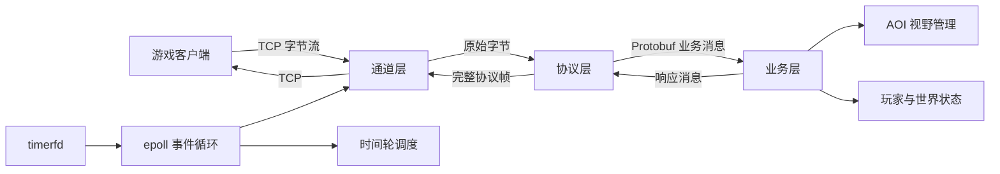

# C++ epoll MMO Game Server

基于 C++、Linux `epoll`、TCP、Protobuf、网格 AOI 与 `timerfd` 时间轮设计的轻量级 MMO 游戏服务器学习项目。

> 本仓库仅公开本人独立撰写的项目介绍与架构设计，不包含课程原始源码或来源不明确的工程文件。后续代码将从空目录独立实现并逐步开放。

## 项目概览

| 项目 | 说明 |
| --- | --- |
| 开发语言 | C++ |
| 运行平台 | Linux |
| 网络模型 | 单线程 epoll LT 事件循环 |
| 通信协议 | TCP + 自定义长度帧 + Protobuf |
| 视野管理 | 网格九宫格 AOI |
| 定时机制 | timerfd + 时间轮 |
| 当前状态 | 架构与设计文档公开，源码独立重写中 |

项目围绕三个问题展开：

1. 如何分离网络收发、协议解析和游戏业务；
2. 如何在 TCP 字节流上识别完整的游戏消息；
3. 如何避免玩家移动消息无差别广播给全服玩家。

## 架构设计

服务器采用“通道层—协议层—业务层”的职责划分，并由 epoll 统一监控网络和定时事件。



### 通道层

- 管理监听套接字和客户端连接；
- 处理 `accept`、`recv`、`send` 与连接关闭；
- 将收到的原始字节交给协议层；
- 不包含具体游戏规则。

### 协议层

- 从 TCP 字节流中提取完整的应用层消息；
- 根据消息类型创建对应的 Protobuf 对象；
- 完成序列化、反序列化、组帧和解帧；
- 在业务消息与网络字节之间建立边界。

### 业务层

- 处理玩家上线、下线、移动和世界聊天；
- 管理玩家 ID、昵称、坐标与场景状态；
- 根据 AOI 查询结果决定消息接收者；
- 通过协议对象发送业务响应，不直接调用 socket API。

## epoll 事件循环

Linux 中，监听套接字、客户端连接和 `timerfd` 都可以通过文件描述符表示。服务器将这些文件描述符注册到同一个 epoll 实例，由一个事件循环统一分发：

```text
监听套接字可读  -> accept 新连接
客户端连接可读  -> recv 玩家消息
客户端连接可写  -> 发送缓冲区数据
timerfd 可读     -> 推进时间轮
```

epoll 只负责通知“哪些文件描述符已经就绪”，实际的连接建立、数据收发和业务处理仍由服务器完成。

## 应用层协议

TCP 是连续字节流，不保存应用层消息边界。项目使用固定 8 字节消息头：

```text
+----------------------+----------------------+-------------------+
| Payload Length (4B)  | Message Type (4B)    | Protobuf Payload  |
+----------------------+----------------------+-------------------+
```

每个连接维护独立接收缓冲区：

1. 新数据先追加到缓冲区；
2. 不足 8 字节时等待下一次接收；
3. 读取消息体长度与消息类型；
4. 消息体未收完整时保留现有数据；
5. 收到完整消息后取出并反序列化；
6. 缓冲区仍有数据时继续解析下一帧。

该过程同时覆盖：

- 半包：一条消息分多次到达；
- 粘包：多条消息在一次读取中到达；
- 连续帧：解析一帧后继续消费剩余字节。

Protobuf 负责“业务对象与二进制消息体之间的转换”，长度帧负责“确定一条消息从哪里开始、到哪里结束”，两者职责不同。

## AOI 视野管理

如果每次移动都通知全部 `N` 名玩家，单次广播需要遍历接近 `N` 个连接。项目将地图划分为固定网格，以当前格及周围八格组成的九宫格作为兴趣区域。

```text
+-----+-----+-----+
|     |     |     |
+-----+-----+-----+
|     |  P  |     |   P：当前玩家所在网格
+-----+-----+-----+
|     |     |     |
+-----+-----+-----+
```

玩家跨格移动时分别计算旧视野和新视野：

- `旧视野 - 新视野`：离开视野的玩家；
- `新视野 - 旧视野`：进入视野的玩家；
- `新视野交集`：继续接收位置更新的玩家。

因此，移动广播对象数由全服玩家数 `N` 收敛为邻域玩家数 `K`。这是广播范围的算法变化，不等同于未经压测的具体性能提升比例。

## timerfd 与时间轮

`timerfd` 将定时器抽象为文件描述符。定时器到期后，该文件描述符变为可读，因此能够与网络连接一起交给 epoll 管理。

时间轮将任务分配到不同槽位：

```text
目标槽位 = (当前槽位 + 延迟刻度) % 槽位数量
剩余圈数 = 延迟刻度 / 槽位数量
```

每次 `timerfd` 到期后推进时间轮，只检查当前槽位中的任务。计划中的独立实现将支持：

- 一次性任务；
- 周期任务；
- 任务取消；
- 空服延迟退出；
- 新玩家接入时取消退出任务。

## 项目能力边界

- 当前设计是单线程事件驱动，不是多线程或多 Reactor；
- epoll 使用 LT 模式，减少边沿触发下漏读事件的实现风险；
- AOI 只减少无关广播对象，不能在没有压测数据时宣称具体提升百分比；
- 项目定位为网络编程学习与工程实践，不宣称生产可用；
- 正式实现需要继续补充协议长度校验、慢连接保护、部分写处理和异常连接回收。

## 独立实现路线

- [ ] 建立 C++17/CMake 项目结构；
- [ ] 实现 RAII 文件描述符与非阻塞 epoll 事件循环；
- [ ] 实现连接缓冲区和长度帧编解码；
- [ ] 设计全新的 Protobuf 消息协议；
- [ ] 实现玩家状态与网格 AOI；
- [ ] 实现 timerfd 驱动的可取消时间轮；
- [ ] 编写命令行测试客户端；
- [ ] 增加单元测试、集成测试和 GitHub Actions。

## 简历表述

> 基于 epoll 构建单线程事件循环，采用“通道层—协议层—业务层”分离网络收发、协议转换与游戏逻辑；设计“长度 + 消息 ID + Protobuf 消息体”帧格式，通过连接级缓冲区与循环拆帧处理 TCP 粘包、半包；基于网格九宫格 AOI 和新旧视野差集缩小玩家移动广播范围；将 timerfd 接入 epoll，并以时间轮统一调度定时任务。

## 说明

本仓库用于展示本人对 Linux 网络编程相关概念的理解，以及后续独立实现的演进过程。仓库不包含原课程源码、生成文件或来源不明确的工程内容，详情见 [NOTICE.md](NOTICE.md)。

## License

本仓库中独立撰写的文档采用 [MIT License](LICENSE) 发布。

